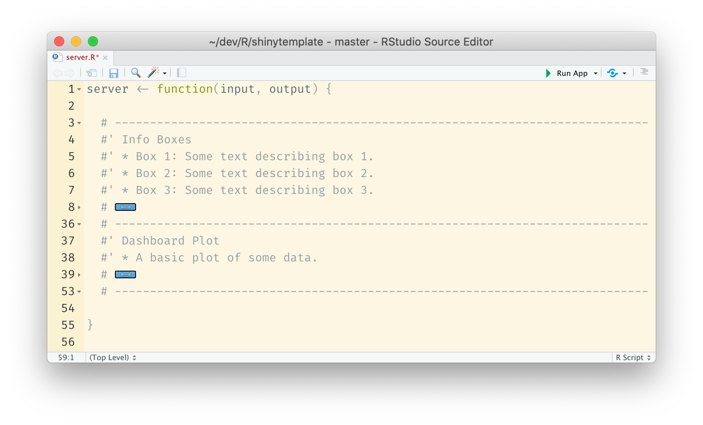

<!-- README.md is generated from README.Rmd. Please edit that file -->

```{r, include = FALSE}
knitr::opts_chunk$set(
  collapse = TRUE,
  comment = "#>"
)
```

# shinytemplate

<!-- badges: start -->
<!-- badges: end -->

An opinionated template for shiny dashboards (work in progress). The goal is to collect a bunch of things I commonly use when creating a dashboard (CSS, file structure, style, etc.), so I can skip all of this when a new project comes along.

## Structure

We use `ui.R`, `server.R`, and `global.R` instead of a single `app.R` file to split the application into smaller pieces. All ui elements are prefixed with `ui_`, utility functions are stored in `utils.R`, all R code (excluding ui, server, and global) are stored in the R directory. The inst/extdata directory is just a habit I picked up from R packages, I stored images and other external data here.

```{r, echo=FALSE}
fs::dir_tree()
```

## Comments

Server code is commented like so:

```
# ----------------------------------------------------------------------------
#' Info Boxes
#' * Box 1: Some text describing box 1.
#' * Box 2: Some text describing box 2.
#' * Box 3: Some text describing box 3.
# ----------------------------------------------------------------------------
```

Where a specific component is labeled and individual pieces are described. This can make large server files a bit more manageable if you use code folding:

```{r echo=FALSE}

```

