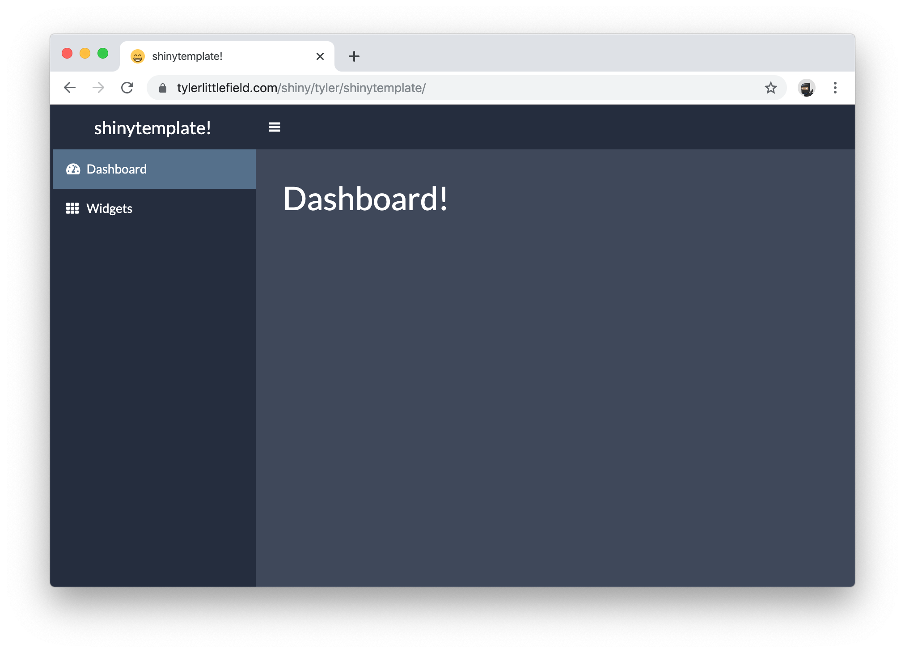
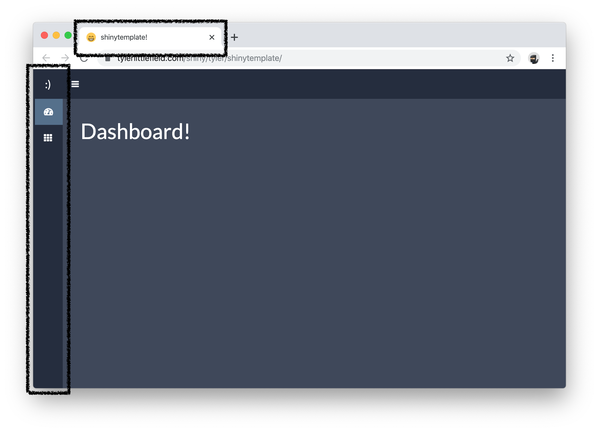
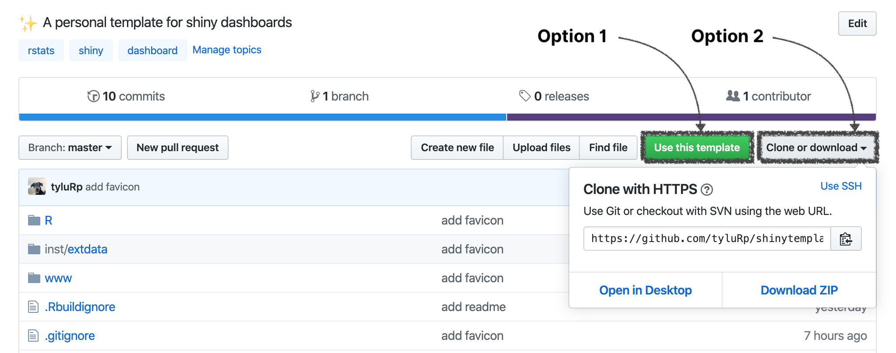

<!-- README.md is generated from README.Rmd. Please edit that file -->

```{r, include = FALSE}
knitr::opts_chunk$set(
  collapse = TRUE,
  comment = "#>"
)
```

# shinytemplate

<!-- badges: start -->
<!-- badges: end -->

```{r echo=FALSE}

```


An opinionated template for shiny dashboards (work in progress). The goal is to collect a bunch of things I commonly use when creating a dashboard (CSS, file structure, style, etc.), so I can skip all of this when a new project comes along. See a live demo of the app [**here**](https://tylerlittlefield.com/shiny/tyler/shinytemplate/).

## Structure

I use `ui.R`, `server.R`, and `global.R` instead of a single `app.R` file to split the application into smaller pieces. All ui elements are prefixed with `ui_`, utility functions are stored in `utils.R`, all R code (excluding ui, server, and global) are stored in the R directory. The inst/extdata directory is just a habit I picked up from R packages, I store images and other external data here.

```{r, echo=FALSE}
fs::dir_tree()
```

## Comments

Server code is commented like so:

```
# ----------------------------------------------------------------------------
#' Info Boxes
#' * Box 1: Some text describing box 1.
#' * Box 2: Some text describing box 2.
#' * Box 3: Some text describing box 3.
# ----------------------------------------------------------------------------
```

Where a specific component is labeled and individual pieces are described. This can make large server files a bit more manageable if you use code folding:

```{r echo=FALSE}
knitr::include_graphics("inst/extdata/server-comments.png")
```

## Utilities

I have a couple utility functions I always use to make a mini sidebar and add a favicon to the tab, these are:

* `enable_mini_sidebar()`
* `mini_sidebar_title()`
* `enable_favicon()`

```{r echo=FALSE}

```

## Usage

This is a personal template but if you'd like to use it you have a couple options.

1. If you have a github account, you can simply fork the repo or hit the "Use this template" button.
2. Alternatively, you can clone or download the repository.

```{r echo=FALSE}

```


